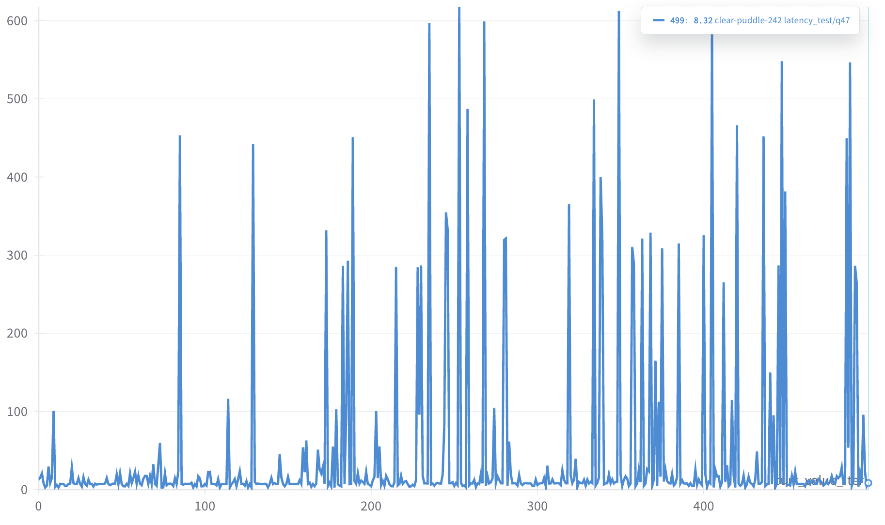

# 블로그 테스트

테스트 테스트 테스트

실시간 반영 테스트

```python
import random
import string

def generate_password(length):
    """This function generates a random password
    of a given length using a combination of
    uppercase letters, lowercase letters,
    digits, and special characters"""
    
    # Define a string containing all possible characters
    all_chars = string.ascii_letters + string.digits + string.punctuation
    
    # Generate a password using a random selection of characters
    password = "".join(random.choice(all_chars) for i in range(length))
    
    return password

# Test the function by generating a password of length 10
password = generate_password(10)
print(password)
```

